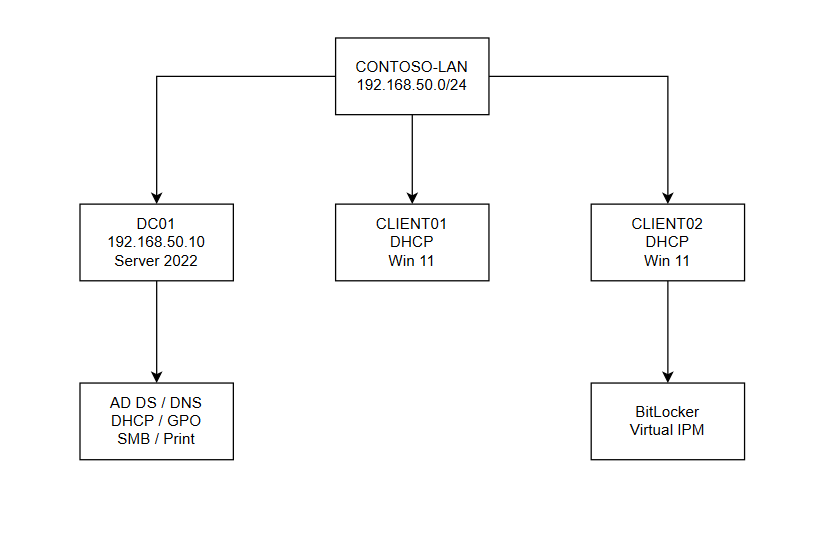

# CONTOSO IT Service Desk Lab

A practical Windows enterprise support lab demonstrating common Service Desk, IT Support and junior systems administration tasks in a Microsoft domain environment.

The project follows a fictional employee through onboarding, workstation deployment, access provisioning, troubleshooting, device replacement, BitLocker recovery and offboarding. Each scenario was managed as a ticket in Jira Service Management and supported with technical evidence.

## Lab Environment

| System | Purpose | Configuration |
|---|---|---|
| DC01 | Domain controller and infrastructure server | Windows Server 2022, 192.168.50.10 |
| CLIENT01 | Original user workstation | Windows 11 Enterprise, DHCP |
| CLIENT02 | Replacement user workstation | Windows 11 Enterprise, DHCP, virtual TPM and BitLocker |
| CONTOSO.local | Active Directory domain | NetBIOS name CONTOSO |
| CONTOSO-LAN | VirtualBox internal network | 192.168.50.0/24 |

## Network Diagram

## Technologies and Skills

- Windows Server 2022
- Windows 11 Enterprise
- Active Directory Domain Services
- Active Directory user and computer administration
- Organisational Units
- Security groups and group nesting
- DNS
- DHCP
- Group Policy
- SMB file sharing
- Share and NTFS permissions
- Print Management
- Account lockout and password resets
- BitLocker and TPM recovery
- PowerShell troubleshooting
- Oracle VirtualBox
- Jira Service Management
- User onboarding and offboarding
- Workstation deployment and replacement

## Service Desk Tickets

1. [New Starter Account](tickets/ticket-01.md)
2. [Join CLIENT01 to the Domain](tickets/ticket-02.md)
3. [Configure the Finance Shared Folder](tickets/ticket-03.md)
4. [Finance Reporting Access](tickets/ticket-04.md)
5. [Password Reset and Account Unlock](tickets/ticket-05.md)
6. [DNS Resolution Troubleshooting](tickets/ticket-06.md)
7. [Finance Network Printer Deployment](tickets/ticket-07.md)
8. [Workstation Replacement](tickets/ticket-08.md)
9. [BitLocker Recovery](tickets/ticket-09.md)
10. [User Offboarding](tickets/ticket-10.md)

A summary of all completed tickets is available in the [Ticket Register](ticket-register.md).

## Supporting Documentation

- [Ticket Register](ticket-register.md)
- [IT Support Procedures](procedures.md)
- [Knowledge Base](knowledge-base.md)
- [Server and Workstation Specifications](lab-environment/server-specifications.md)
- [Virtual Machine Configuration](lab-environment/vm-configuration.md)
- [Technical Evidence](Screenshots)

## Project Approach

The lab was designed around realistic support scenarios rather than isolated configuration exercises. Each ticket followed a basic service desk workflow:

1. Record the request or incident.
2. Perform initial triage.
3. Investigate or implement the required change.
4. Verify the result.
5. Capture technical evidence.
6. Document the resolution.
7. Resolve the Jira ticket.

The scenarios include both successful implementation tasks and deliberately introduced faults, allowing troubleshooting and root-cause analysis to be demonstrated alongside routine administration.

## Security and Privacy

This is a fictional lab environment created for learning and portfolio purposes. It does not contain production systems or real customer information.
